# Best Practices Decision Tree for Building a Copilot Studio Agent

## Objectives

Ensure a comprehensive approach to building your custom Copilot:

- Set up the necessary environment and access rights.
- Choose the orchestration mode that best fits your needs.
- Plan how the bot will retrieve or provide information (leveraging knowledge sources for existing info and topics for interactive flows).
- Identify if any structured data capture (entities) is needed to understand user requests.
- Integrate external systems and actions for the bot to actually solve user requests. Decide on the appropriate method to implement any complex workflows (in-agent flows vs. external flows).

## Contents

The lab highlights the **key decisions and best practices for building a Copilot Studio agent** – from setup and orchestration mode to knowledge integration, entity design, external tools, automation flows, and AI model choice. The **most important choices are presented first**, using a clear hierarchy of bullet points and comparison tables for quick scanning.

## Prerequisites

- **Licensing & Environment**: Make sure you have a Copilot Studio tenant license and user license in your Microsoft tenant (tenant license for the org, user license for each builder). Create or use a Power **Platform environment with Dataverse** to host your agent (Copilot Studio uses Dataverse for storage). You’ll need at leat *Environment Maker* security role in that environment to configure the agent, but *System Customizer* role is recommended.
- **Feature Availability**: Check that Generative AI orchestration is allowed in your environment (admins can disable it). If disabled, you’ll be limited to classic mode. Also ensure any Premium connectors or Power Automate features you plan to use are licensed, authorized and not blocked by DLPs.
- **Connections & Permissions**: Verify you have set up connections for any external systems you’ll integrate (e.g. SharePoint, CRM, third-party APIs). The agent will run connectors under either the end user’s credentials or a provided service account – plan authentication accordingly. Ensure all target knowledge sources (SharePoint sites, documents) are accessible to your users, so the agent can retrieve content.

## Key Decisions and Best Practices

### 1. Choose Orchestration Mode: Generative AI vs Classic

**Orchestration mode** determines how the agent decides on responses:

- **Generative Orchestration (AI-driven)** – *Recommended for most cases*. The agent uses a GPT model to **interpret user intent and dynamically choose how to respond**. It can combine multiple approaches (topics, tools, and knowledge) in one answer, and auto-generates questions to clarify missing details. This leads to a more natural and flexible conversation
- **Classic Orchestration (Rule-based)** – The agent uses predefined **trigger phrases** to map user input to a single topic dialog. It will only do what you explicitly script in that topic. Tools and knowledge are only used if you call them within a topic or as a last resort when no topic matches (bost conversation topic). This mode gives you tight control but is less adaptive to unexpected queries.

**Decision Guidance**: Unless you have a strong reason to avoid generative AI (such as strict compliance requirements or disabled by admin), **use Generative Orchestration (the default)** to maximize your agent’s understanding and capabilities. Classic mode is mainly for simple FAQ bots or when every response must follow a predetermined script. If you do use generative mode, invest time in writing good **descriptions** for topics (you can use also topics in this mode), tools, and knowledge sources (since the AI relies on those). If using classic, focus on comprehensive trigger phrases for each topic.

### 2. Design Content: Knowledge Sources vs Scripted Topics

Decide how your agent will get the information to answer user queries:

- **Use Knowledge Sources (Retrieval-Augmented Q&A)** when you have existing content (policies, manuals, FAQs, product info) that the agent should draw from. Copilot Studio can index **SharePoint sites, PDFs/Docs, websites, Dataverse records etc.**, and the generative agent will search these to answer questions. This is ideal for informational queries like “What is our travel policy?” or “Tell me about product X” – the agent will fetch the answer from your documentation, ensuring accuracy. 

    *Best Practice*: Add all relevant knowledge sources (e.g., your intranet pages, knowledge base files) so the agent has a rich library to pull from. Provide each source a clear description (e.g., “Company HR Policies SharePoint – contains vacation, benefits, and conduct policies”) to help the AI choose the right one.

- **Create Scripted Topics (Dialog Flows)** for **procedural or transactional** conversations. If the user’s request requires multiple steps or business logic, you can design a topic that guides the conversation. For example, “Reset my password” or “Schedule a meeting” might be a topic with a sequence: greet user, ask for necessary info, call an action, show result. Topics let you enforce order and include logic branches, validations, or confirmations. Even with generative orchestration, topics are useful to handle these multi-turn interactions or to ensure critical compliance wording.
   
    *Tip*: Write a concise description for each topic (what it does or covers) – the AI uses that to pick the right topic when in generative mode.

- **Combine Both**: These are not mutually exclusive – a strong Copilot agent often uses knowledge for general Q&A and topics for specific transactions. Generative orchestration will juggle both: if user asks a simple factual question, it may just search the knowledge base; if they ask for a process, it will trigger the appropriate topic. In classic mode, you might intentionally fall back to knowledge for anything that doesn’t match a topic (conversation boosting topic). For best results, configure knowledge sources for broad coverage, and create topics for the top tasks or complex dialogs.

### 3. Plan Entities for User Input (Optional Data Extraction)
Entities help the agent recognize and capture specific information from user messages (like dates, numbers, names, IDs). They are essential if your conversation requires pulling out structured data from what the user says, or if you need to ask for certain details:

- **Prebuilt Entities**: Copilot Studio comes with dozens of prebuilt entities for common data types – e.g. Age, DateTime, Currency (Money), Email Address, Person Name, etc.. You can simply enable any that are relevant in your agent’s settings. The agent will then automatically detect those in user utterances. For example, if a user says “next Thursday at 3pm”, the DateTime entity will extract the exact timestamp value for you to use. Using prebuilt entities saves you time and improves accuracy for common inputs.
- **Custom Entities**: For domain-specific needs, define custom entities. There are two types: **Closed List** (a finite list of categories or values) and **Regex** (pattern-based). Closed list entities are great for things like product categories, issue types, or departments (e.g., an “IssueType” entity with values {Email problem, VPN issue, Hardware, Software} and synonyms for each). Regex entities can handle formats like order numbers, employee IDs, etc. (using regular expressions to match the format). Custom entities allow the agent to understand your domain jargon and slot those values into variables.
- **Slot Filling (Prompting for Entities)**: If a topic or tool requires a certain piece of info (like an Order Number or Date), you can link that requirement to an entity. In generative mode, the agent will auto-prompt the user for that info if it wasn’t already provided. In classic mode, you have to add a question node to ask for it. Either way (generative or classic mode), the conversation will pause until the user gives a valid answer for that entity. This ensures you don’t proceed without key details.
- **Using Captured Data**: Once an entity is recognized, its value is stored in a variable (with the same name as the entity by default). You can use these variables later in the conversation – e.g., confirm back to the user (“I’ve booked your meeting for **{DateTime}**.”) or pass them into tools/actions (like an API call needing that parameter).
- **Making Variables Available Across Topics**: Variables created from entities are local to the topic unless you choose otherwise. To reuse a variable in different topics (e.g., a user’s ID, region, or product selection), open the variable’s Properties and check **Usage: Global**. This makes the variable accessible throughout the entire agent, not just the current topic.

Entities aren’t mandatory for simple bots, but they become crucial as soon as your agent needs structured info from natural language. They essentially give your Copilot some NLU (Natural Language Understanding) superpowers beyond plain intent matching, making interactions more precise and context-aware.

### 4. Integrate External Systems with Tools
If your agent needs to **take actions or fetch data** from outside of its own knowledge (e.g., update a ticket, query a database, call an API, send an email), you should add Tools to enable these capabilities. Copilot Studio supports multiple integration mechanisms, effectively serving as the agent’s “hands and eyes” to interact with other systems:

- **Power Platform Connectors**: These are the easiest way to connect to Microsoft and many third-party services. Via connectors, you can add tools for thousands of operations (e.g., “Send an email” via Office 365 Outlook, “Create a record” in Dynamics or Dataverse, “Post a message” in Teams). **Prebuilt connectors** cover standard services. If a suitable connector doesn’t exist, you can build a **Custom Connector** for any REST API. When adding a connector-based tool, you’ll pick a particular action (like a specific API endpoint) to expose to the agent. Example: Using the Jira connector to add a “Create Jira Issue” tool.
- **REST API (direct)**: Copilot Studio lets you define an HTTP endpoint directly as a tool if you have the URL, method, and auth details. This is a good fallback if you don’t want to create a full custom connector. You can specify the request and which parts of the response to return. Use this for simpler integrations or prototypes with any web service.
- **Agent Flows**: (More on these in the next section.) In short, an Agent Flow is a mini workflow you design *within Copilot Studio* that can perform multiple steps and use various connectors in sequence. You can add an Agent Flow as a tool to encapsulate a complex action. For instance, an Agent Flow tool could take a user query, perform a calculation or lookup by combining results from different systems, and return a composite answer.
- **Prompt (Single-turn skill)**: A Prompt tool is essentially a custom AI prompt that runs when invoked. You might use this to do an on-demand text transformation or a mini-cognition task. For example, a “Summarize Text” prompt tool that takes a long text as input and uses the model (possibly with some knowledge context) to produce a summary. This is less about external systems, more about adding a specialized AI capability. Some times are use as well to disambiguation.
- **Model Context Protocol (MCP) Server**: For advanced scenarios, you can connect an **MCP server** which provides extended tools and resources to the agent. This could be a custom back-end that offers a bundle of domain-specific functions or data beyond what connectors provide, often used by enterprises to integrate proprietary logic.
- **Computer Vision “Use UI” (RPA)**: The “Computer use” tool type allows the agent to control a UI (web or desktop) like a human would – clicking, typing, etc., via an RPA approach. This is rarely needed unless no API/connector exists. It’s complex and usually not the first choice, but it’s an option to integrate with legacy systems that only have a UI.

*Best Practice*: When you add any tool, give it a clear name and description. The description is vital in generative mode – it tells the AI when and why to use that tool. For example: “**Tool: CreateTicket** – Creates a support ticket in ServiceNow with a given title and description.”. In generative orchestration, the agent will decide to run this tool if the user asks something like “I need to report an IT issue” because the description matches. Ensure the tool is configured with correct authentication (user’s credentials vs a service account used to create the agent) depending on whether you want actions done as the user or system. You can also set a tool to require user confirmation (the agent will ask “Do you want me to do X?” before executing) – use this for potentially sensitive actions.

*Best Practice*: For External Integration, start by listing what actions your agent must be able to do, then choose the simplest mechanism for each:
- If a **prebuilt connector** exists for the action (and you have access), use it.
- Use **Agent Flows** to orchestrate multi-step sequences or to transform data between steps.
- Use **direct REST or custom connector** for any service not covered, making sure to handle auth securely.
- Keep **tool descriptions** distinct so the AI doesn’t mix them up. Also monitor in testing that the agent uses tools appropriately (you can see tool invocations in the test Activity log).

### 5. Automation Workflows: Agent Flows vs Power Automate Flows
When implementing multi-step operations or complex logic, you have a choice between using Agent Flows within Copilot Studio or invoking external Power Automate flows. Here’s how to decide:

- **Agent Flows (in Copilot Studio)**: These are defined directly in the Copilot Studio interface (appearing as a tool of type “Agent flow”). Use Agent Flows for **self-contained logic** that’s closely tied to your agent. They can include multiple actions (using connectors), simple conditions, and data manipulation. Agent Flows run **natively as part of the agent’s execution**, and they don’t require separate Power Automate licensing to run (they consume the Copilot agent’s capacity). They are ideal if your operation is only needed for this agent and you want to manage it all in one place. For example, an Agent Flow could handle “Reset user password”: call an API to generate a temp password, then send an email to the user with the new credentials – all within a single flow attached to the agent.
- **Power Automate Cloud Flows (external)**: These are the standard flows you create in Power Automate (the larger ecosystem). You might choose this if you **already have flows built** that you want to reuse, or if the process might be triggered outside the bot as well. In Copilot Studio, you can add an existing cloud flow as a tool (via connector or via an option in the Add Tool wizard). Use PA flows if the logic is complex, long-running, or maintained by a different team, or if it interacts with systems in ways easier to do in PA (e.g., UI flows for legacy systems).

*Best Practice*: If starting from scratch within Copilot Studio, you should create Agent Flows for most things to keep it simple. But if, say, your organization already has a “Create Purchase Order” flow, you can just call that rather than reinventing it. Either way, from the user’s perspective, these operations are tools the agent can call to get something done.

*Tip*: After integrating, test the end-to-end automation by triggering it through the agent to ensure data passes correctly and the user gets a confirmation or result back.

### 6. Select the AI Model for Generative Responses
Finally, choose the AI model that powers your agent’s understanding and language generation. Copilot Studio allows switching the primary model:

- **Default (General-purpose) Model**: This is usually the latest stable GPT-4-based model (as of late 2025, the default is GPT-4.1). It offers a strong mix of quality and reliability. In most cases, stick with the default unless you have specific needs – it’s considered the best general performer and will be automatically updated over time.
- **“Deep” Reasoning Model**: Tagged as **Deep**, this type is optimised for complex, multi-step reasoning and tool usage. For example, if your agent will analyze lengthy documents or perform intricate multi-hop decisions (like troubleshooting across multiple systems or drafting detailed reports), a Deep model (GPT-4 series or above) may yield better results. The trade-off is typically **higher latency and cost**. User the word **Reason** in an agent's instruction to use this *Deep reasoning*.
- **“General” Lightweight Model**: Tagged as **General**, these models prioritise speed and cost-efficiency for everyday tasks. Use them for simpler bots where fast responses are crucial and the content is straightforward (small talk, simple FAQs). They have **shallower reasoning depth** and may not handle very complex queries well.
- **Auto / Adaptive Setting**: An Auto tag means the system will route queries dynamically, potentially using heavier reasoning only when needed. This can be a good compromise if available, letting the platform decide per conversation turn.
- **Experimental/Preview Models**: You might see options for the newest experimental models (GPT-5 preview, etc.). Use caution with these – they can be more powerful, but are not fully tested and not meant for production. Admins might disable these entirely. Evaluate them in a dev environment if curious, but for a stable agent, stick to GA (generally available) models.

*Best Practice*: For most enterprise use cases, start with the Default model which is balanced for mixed workloads. If you notice the agent struggling with complex tasks or being too slow/verbose, you can adjust to a General (faster) model or if not reasoning well enough, try Deep Reasoning.

## Copilot Studio Decision Tree

Next you will find a Flowchart representation (**Decision Tree**) about the above topics that will help you with key decision steps. This diagram renders natively on GitHub — you can also paste it into [mermaid.live](https://mermaid.live) to export as SVG/PNG.

```mermaid
flowchart TD
    START([🚀 Start Building Agent]) --> ORCH{1. Orchestration Mode?}

    %% ── Orchestration ──
    ORCH -->|Recommended| GEN[✅ Generative AI]
    ORCH -->|Strict control needed| CLASSIC[Classic / Rule-based]

    GEN --> GEN_ACTIONS[Write clear descriptions for<br/>Topics, Tools & Knowledge<br/>Enable auto-prompt for missing info]
    GEN_ACTIONS --> INFO

    CLASSIC --> CLASSIC_ACTIONS[Define trigger phrases per Topic<br/>Script all tool calls inside Topics]
    CLASSIC_ACTIONS --> INFO

    %% ── Information Handling ──
    INFO{2. Information Handling?}
    INFO --> KS{Knowledge Sources<br/>needed?}
    INFO --> TOPICS{Topics needed?}

    KS -->|Yes| KS_ADD[Add SharePoint, Docs,<br/>Websites, Dataverse<br/>Provide descriptive names]
    KS -->|No| TOPICS

    TOPICS -->|Yes| TOPICS_CREATE[Create multi-turn flows<br/>Add input/output variables<br/>Include fallback handling]
    TOPICS -->|No| TOPICS_SKIP[Rely on Knowledge +<br/>generative answers]

    KS_ADD --> COMBINE[💡 Combine Both for best coverage]
    TOPICS_CREATE --> COMBINE
    TOPICS_SKIP --> COMBINE
    COMBINE --> ENT

    %% ── Entities ──
    ENT{3. Entities Required?}
    ENT -->|Yes| ENT_ACTIONS[Prebuilt: Date, Money, Email<br/>Custom: Closed List, Regex<br/>Enable Slot Filling for missing details]
    ENT -->|No| TOOLS
    ENT_ACTIONS --> TOOLS

    %% ── External Tools ──
    TOOLS{4. External Actions<br/>Needed?}
    TOOLS -->|Yes| TOOLS_ADD[Add Tools]
    TOOLS -->|No| AUTO
    TOOLS_ADD --> TOOLS_LIST[Power Platform Connectors<br/>REST API endpoints<br/>Agent Flows — multi-step logic<br/>Power Automate Flows — enterprise<br/>MCP Server — advanced integrations]
    TOOLS_LIST --> TOOLS_BP[📌 Best Practice:<br/>Clear tool descriptions<br/>for AI orchestration]
    TOOLS_BP --> AUTO

    %% ── Automation ──
    AUTO{5. Automation Choice?}
    AUTO -->|Built-in, no extra licence| AF[Agent Flows]
    AUTO -->|Reusable, may need licence| PA[Power Automate Flows]
    AF --> MODEL
    PA --> MODEL

    %% ── Model Selection ──
    MODEL{6. AI Model Selection?}
    MODEL -->|Balanced — most cases| DEFAULT[✅ Default GPT-4.1]
    MODEL -->|Complex reasoning| DEEP[Deep Reasoning]
    MODEL -->|Fast, cost-efficient| GENERAL[General / Lightweight]
    MODEL -->|System decides per query| ADAPTIVE[Auto / Adaptive]

    DEFAULT --> DONE([🎉 Agent Ready — Test & Iterate])
    DEEP --> DONE
    GENERAL --> DONE
    ADAPTIVE --> DONE

    %% ── Styles ──
    classDef decision fill:#4a90d9,stroke:#2c5f8a,color:#fff,font-weight:bold
    classDef action fill:#f0f4ff,stroke:#4a90d9,color:#1a1a2e
    classDef recommended fill:#2ecc71,stroke:#1a9c54,color:#fff,font-weight:bold
    classDef tip fill:#fff3cd,stroke:#d4a843,color:#1a1a2e
    classDef endpoint fill:#6c5ce7,stroke:#4834a8,color:#fff,font-weight:bold

    class ORCH,INFO,KS,TOPICS,ENT,TOOLS,AUTO,MODEL decision
    class GEN_ACTIONS,CLASSIC_ACTIONS,KS_ADD,TOPICS_CREATE,TOPICS_SKIP,ENT_ACTIONS,TOOLS_ADD,TOOLS_LIST action
    class GEN,DEFAULT recommended
    class COMBINE,TOOLS_BP tip
    class START,DONE endpoint
```

## Summary

Building a Copilot Studio agent involves balancing structured design (topics, flows, entities) with AI-driven flexibility (generative orchestration using knowledge and tools).

*Tip*: Start simple and add complexity as needed: for a basic Q&A bot, you might only need generative mode with a few knowledge sources and minimal topics; for a complex workflow assistant, you’ll design topics and integrate multiple tools. Always keep the user’s experience in mind – clarity, correctness, and convenience. 

By leveraging the rich capabilities of Copilot Studio following the best practices above, you can implement a successful Copilot agent that truly augments your users’ abilities. Happy building

