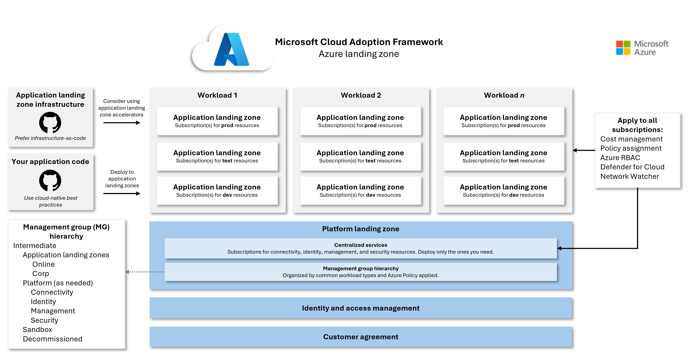
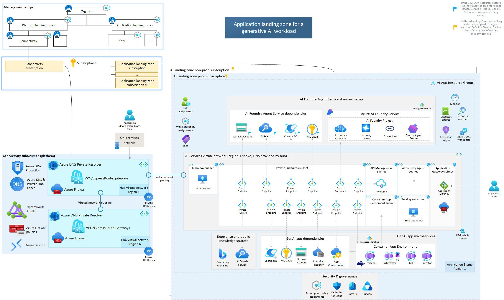
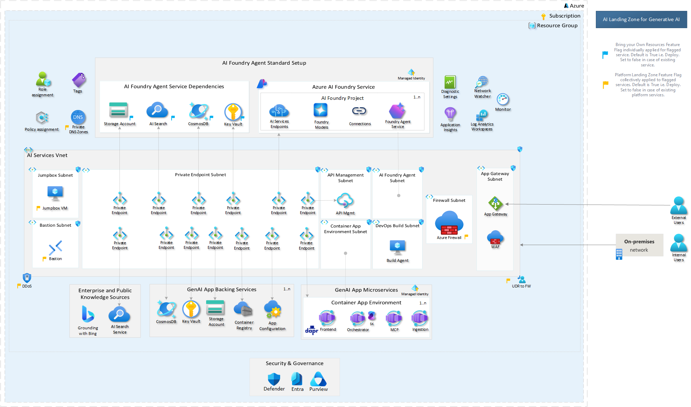

<!-- _class: title -->
<!-- _paginate: false -->

# AI Landing Zones Fundamentals

### Partner Enablement Workshop

<br>

**AI Center of Excellence V2 | Q3 FY2026**

<!--
Speaker notes: Welcome participants. This is Workshop 1 of 3 in the AI Landing Zone partner enablement series.
-->

---

## Agenda

| Module | Topic | Duration |
|--------|-------|----------|
| 1 | What is AI Landing Zone? | 25 min |
| 2 | Reference Architectures | 30 min |
| — | Break | 10 min |
| 3 | Design Checklist Walkthrough | 40 min |
| 4 | Deployment Options | 25 min |
| 5 | Partner Engagement Scenarios | 20 min |
| — | Wrap-up & Next Steps | 15 min |

<!--
Speaker notes: Walk through the agenda. Each module builds on the previous one. We'll take a break after Module 2.
-->

---

## Learning Objectives

By the end of this workshop, you will be able to:

1. **Explain** what Azure AI Landing Zones are and why they matter
2. **Identify** key architecture components
3. **Compare** deployment options (with/without Platform LZ)
4. **Navigate** the official Design Checklist across 10 design areas
5. **Choose** appropriate deployment approach for different scenarios
6. **Plan** customer engagements using partner frameworks

<!--
Speaker notes: These objectives are measurable. We'll check for understanding at the end of each module.
-->

---

## Housekeeping

- **Duration**: 2-3 hours
- **Breaks**: 10 min after Module 2
- **Questions**: Welcome anytime — raise hand or use chat
- **Materials**: Links in chat
- **Recording**: [Yes/No]

> ⚠️ **Cost Warning**: If you deploy Azure resources during or after this workshop, a full AI Landing Zone deployment can cost **$1,500-3,500+/month**. Delete all resources immediately after. See Prerequisites doc for details.

<!--
Speaker notes: Emphasize the cost warning early. Participants who plan to deploy resources should set up budget alerts first.
-->

---

<!-- _class: title -->

# Module 1
### What is AI Landing Zone?

<!--
Speaker notes: 25 minutes. Start with the "why" before the "how".
-->

---

## The AI Challenge

Enterprises want to deploy Gen AI workloads but face real barriers:

- **Security** — How do we protect sensitive data?
- **Governance** — Who controls what the AI can access?
- **Scalability** — Can we go from PoC to production?
- **Speed** — Starting from scratch is slow and risky

<br>

### Key Question:
> How do we accelerate **production-ready** AI deployments?

<!--
Speaker notes: Ask the audience: "How many of you have had customers ask about deploying Gen AI apps? And how many have seen those conversations stall when security comes up?"
-->

---

## AI Landing Zone — Defined

> *"A secure, resilient, and scalable reference architecture for AI apps and agents"*

- Purpose-built for **Azure AI Foundry** and Gen AI workloads
- Implements Azure best practices **from Day 0**
- Available as: **Bicep**, **Terraform**, **[Portal (Deploy to Azure)](https://github.com/Azure/AI-Landing-Zones#deploy-to-azure)**
- Working IaC code — not just documentation

**Source**: [Azure/AI-Landing-Zones](https://github.com/Azure/AI-Landing-Zones)

<!--
Speaker notes: Emphasize this is hosted on the Azure GitHub org — official Microsoft guidance, not a community project.
-->

---

## Where AI Landing Zones Fit in CAF



**CAF Landing Zone Hierarchy:**

- **Platform LZ** → Shared services (Identity, Connectivity, Management) — owned by central IT
- **Application LZ** → Where workloads deploy
- **AI Landing Zone** → Goes here ☝️

<div class="key-point">

AI is just another workload from CAF perspective.
**NOT** a separate landing zone type.

</div>

<!--
Speaker notes: This is a critical concept. AI Landing Zones are Application Landing Zones within CAF. They deploy INTO existing Azure Landing Zone architectures.
-->

---

## Platform vs. Application Landing Zone

<div class="columns">
<div>

### Platform Team Provides
- Hub virtual network
- Azure Firewall, VPN/ExpressRoute
- Azure Bastion for jump box access
- Private DNS zones
- DDoS protection
- Governance policies at MG level

</div>
<div>

### Workload Team Owns (AI LZ)
- Spoke virtual network subnets, NSGs
- AI Foundry, AI Search, Cosmos DB
- App Service / Container Apps
- Private endpoints to PaaS services
- Workload-specific monitoring

</div>
</div>

**Partner Question**: Does your customer have an existing Platform LZ?

<!--
Speaker notes: This determines which architecture option to recommend.
-->

---

## CAF & WAF Alignment

<div class="columns">
<div>

### Cloud Adoption Framework
- AI Landing Zone = "AI Ready" stage
- Specifically: "AI on Azure Platforms (PaaS)"
- Links to CAF AI Strategy and Checklist

</div>
<div>

### Well-Architected Framework
- Follows WAF design principles for AI
- **Reliability** — Resilient deployments
- **Security** — Zero-trust by design
- **Cost** — Optimization built in
- **Operations** — Observable by default
- **Performance** — Scalable architecture

</div>
</div>

<!--
Speaker notes: This isn't a one-off solution. It integrates with the broader cloud adoption story your customers are already familiar with.
-->

---

## Supported Use Cases & AI Agent Types

**Classic RAG** (deterministic retrieval): Chat, document Q&A, knowledge mining

**AI Agents** (adaptive reasoning): Agents that reason, plan, and use tools dynamically

| Agent Type | What It Does | Example |
|------------|-------------|--------|
| **Productivity** | Retrieve & synthesize information | Knowledge management, customer support |
| **Action** | Perform specific tasks in workflows | Ticket creation, system monitoring |
| **Automation** | Multi-step processes, minimal oversight | Supply chain optimization, approval flows |

**Key Question**: Does your customer need classic RAG or AI agents?

<!--
Speaker notes: Not every workload needs an agent. Start simple. Classic RAG is cheaper, faster, and more predictable.
-->

---

## AI Agent Architecture — 5 Core Components

Every AI agent is built on **5 components**:

1. **Generative AI Model** — The reasoning engine
2. **Instructions** — Scope, boundaries, behavioral guidelines
3. **Retrieval (Knowledge)** — Grounding data and context (reduces hallucinations)
4. **Actions (Tools)** — Functions, APIs, systems the agent can call
5. **Memory** — Conversation history and state

<div class="key-point">

**Key Insight**: Components 3 (Retrieval) and 4 (Actions) are what the Landing Zone infrastructure directly supports — AI Search, Cosmos DB, APIs, Logic Apps, Functions.

</div>

<!--
Speaker notes: When we look at the reference architecture in Module 2, you'll see how each LZ component maps to these agent building blocks.
-->

---

## When to Use Agents vs. Classic RAG

<div class="columns">
<div>

### ❌ Don't Use Agents When
- Task is structured, predictable, rule-based → Use **deterministic code**
- Goal is static knowledge retrieval / Q&A → Use **classic RAG**

</div>
<div>

### ✅ Use Agents When
- Dynamic decision-making required (multi-step reasoning)
- Complex orchestration (chaining tools, APIs)
- Adaptive behavior (ambiguous inputs, intent interpretation)

</div>
</div>

<br>

> **Partner Talking Point**: *"Not every AI workload needs an agent. Start with the simplest approach. Classic RAG is cheaper, faster, and more predictable. Graduate to agents when reasoning and tool orchestration are genuinely required."*

<!--
Speaker notes: Reference the CAF AI agent decision tree for detailed guidance.
-->

---

## Key Takeaways — Module 1

- AI Landing Zone = **production-ready AI foundation**
- Supports both **classic RAG** and **AI agent** workloads
- Aligns with **CAF** (including AI Agent Adoption) and **WAF**
- Accelerates enterprise AI adoption
- Reduces risk and time-to-production
- Use the **agent decision tree** to help partners qualify the right workload type

<!--
Speaker notes: Quick check — "Can someone explain what makes AI Landing Zone different from just deploying Azure AI services directly?"
-->

---

<!-- _class: title -->

# Module 2
### Reference Architectures

<!--
Speaker notes: 30 minutes. Two architecture options — choose based on customer context.
-->

---

## Two Architecture Options

| | With Platform LZ | Without Platform LZ |
|---|---|---|
| **Target** | Enterprise | Greenfield / PoC |
| **Networking** | Hub-spoke (shared) | Self-contained |
| **Security** | Central Firewall, Bastion | Own networking & security |
| **Speed** | More setup | Faster start |
| **Production-ready** | ✅ Yes | ✅ Yes |

Both are valid. Choose based on **customer context**.

<!--
Speaker notes: The key question is: "Does the customer have an existing Azure Landing Zone?"
-->

---

## With Platform Landing Zone



- Leverages existing **hub-spoke networking**
- Uses central **Firewall, Bastion, DNS**
- AI workload is an application landing zone subscription
- Best for: **enterprises, regulated industries**

<!--
Speaker notes: Walk through the layers top to bottom. Notice all private endpoints — no public exposure.
-->

---

## Without Platform Landing Zone



- Self-contained in a **single subscription**
- Includes own networking, security, governance
- Faster to deploy for isolated scenarios
- Best for: **PoCs, smaller orgs, quick starts**
- Can migrate to platform model later

<!--
Speaker notes: This is a "complete" landing zone in miniature. Not less secure — just manages everything internally.
-->

---

## Key Components — AI Layer

| Component | Purpose |
|-----------|---------|
| **Azure AI Foundry** | Development platform — model management, prompt engineering |
| **AI Services** | Model endpoints (GPT-4, embeddings, etc.) |
| **AI Search** | RAG retrieval — vector search, semantic ranking |
| **Connections** | Service integrations and data source links |

<!--
Speaker notes: AI Foundry is the central hub. Everything else connects to it.
-->

---

## Key Components — Compute Layer

| Component | Purpose |
|-----------|---------|
| **Container Apps** | Microservices runtime — API backends |
| **App Service** | Web front-ends — user-facing apps |
| **Functions** | Event-driven compute — triggers, processing |
| **Scaling** | Auto-scale capabilities across all compute |

<!--
Speaker notes: Container Apps is increasingly the recommended choice for new AI workloads.
-->

---

## Key Components — Data Layer

| Component | Purpose |
|-----------|---------|
| **Cosmos DB** | Chat history, context storage, agent memory |
| **Storage Account** | Document storage, files, blobs |
| **AI Search** | Vector search, embeddings index |
| **(Optional) Fabric** | Enterprise data foundation, analytics |

<!--
Speaker notes: Cosmos DB provides the "memory" component for AI agents. AI Search provides the "retrieval" component.
-->

---

## Key Components — Security Layer

| Component | Purpose |
|-----------|---------|
| **Private Endpoints** | No public exposure for PaaS services |
| **Key Vault** | Secrets and certificate management |
| **Managed Identity** | No credentials in code — zero secrets |
| **NSGs & Firewall** | Network isolation and egress control |
| **Bastion** | Secure admin access to jump boxes |

> Every PaaS service connects via **private endpoint**. This is non-negotiable in enterprise deployments.

<!--
Speaker notes: Emphasize the zero-trust approach. No API keys in code, no public endpoints.
-->

---

## Key Components — Governance Layer

| Component | Purpose |
|-----------|---------|
| **Defender for Cloud** | Security posture management |
| **Purview** | Data governance and classification |
| **Azure Policy** | Compliance automation and enforcement |
| **Azure Monitor** | Observability — logs, metrics, alerts |

<!--
Speaker notes: These services provide Day 2 operations capabilities from Day 0.
-->

---

## Choosing Your Architecture

| Factor | With Platform LZ | Without Platform LZ |
|--------|:-:|:-:|
| Customer has existing ALZ | ✅ Recommended | ⚠️ Consider migration |
| Greenfield deployment | ⚠️ More setup | ✅ Faster start |
| Enterprise / regulated | ✅ Best fit | ⚠️ May need upgrade |
| PoC / Pilot | ⚠️ Overkill | ✅ Right-sized |

<!--
Speaker notes: "When would you recommend the standalone architecture over the platform-integrated one?"
-->

---

## Key Takeaways — Module 2

- **Two validated** architecture options
- Choose based on **customer context**
- All components are **Azure PaaS**
- **Security-first** design by default
- Both options are **production-ready**

<!--
Speaker notes: Let's take a 10-minute break. When we come back, we'll dive into the Design Checklist — the most practical tool you'll use with customers.
-->

---

<!-- _class: title -->

# ☕ Break
### 10 minutes — back at [TIME]

<!--
Speaker notes: Encourage participants to explore the GitHub repos during the break.
-->

---

<!-- _class: title -->

# Module 3
### Design Checklist Walkthrough

<!--
Speaker notes: 40 minutes. This is the most hands-on module. The checklist becomes their primary engagement tool.
-->

---

## The Design Checklist

> Your **new best friend** for customer engagements

- **40+ recommendations** across 10 design areas
- Based on **CAF + WAF** best practices
- Works for **greenfield** and **brownfield**
- Assessment tool, design guide, and conversation framework

**Link**: [Design Checklist on GitHub](https://github.com/Azure/AI-Landing-Zones/blob/main/docs/AI-Landing-Zones-Design-Checklist.md)

<!--
Speaker notes: Open the checklist in a browser tab. Show the actual document.
-->

---

## 10 Design Areas Overview

| Area | # Recs | Key Focus |
|------|:------:|-----------|
| Networking | 9 | Private endpoints, Firewall, DNS |
| Identity | 6 | Managed Identity, Entra ID, RBAC |
| Security | 5 | Defender, Purview, Content Safety |
| Monitoring | 6 | Tracing, alerts, drift detection |
| Cost | 4 | Pricing models, auto-shutdown |
| Data | 3 | Storage, data governance |
| Governance | 5 | Policy, compliance, Responsible AI |
| Reliability | 1 | Resilience patterns |
| Resource Org | 4 | Subscription and resource structure |
| Compute | 1 | Compute selection |

<!--
Speaker notes: We'll focus deep-dives on Networking, Identity, Security, and Monitoring — the first four. That's where most customer conversations start.
-->

---

## Deep Dive — Networking (N-R1 to N-R9)

| Rec | Recommendation | Priority |
|-----|---------------|:--------:|
| N-R1 | DDoS Protection | High |
| N-R2 | Bastion for jumpbox access | High |
| **N-R3** | **Private endpoints everywhere** | **Critical** |
| N-R4 | NSGs on all subnets | High |
| N-R5 | WAF via App Gateway/Front Door | High |
| N-R7 | Firewall for egress control | High |
| N-R8 | Private DNS zones | High |
| **N-R9** | **Restrict outbound by default** | **Critical** |

<!--
Speaker notes: N-R3 and N-R9 come up in almost every enterprise conversation.
-->

---

## Deep Dive — Identity (I-R1 to I-R6)

**One theme: eliminate credentials**

| Rec | Recommendation |
|-----|---------------|
| **I-R1** | **Managed Identity with least privilege** |
| I-R2 | MFA + PIM for sensitive accounts |
| **I-R3** | **Entra ID for authentication (not API keys)** |
| I-R4 | Conditional Access policies |
| I-R5 | RBAC with least privilege |
| **I-R6** | **Disable key-based access entirely** |

> **Goal**: Zero secrets in code or config.

<!--
Speaker notes: I-R1, I-R3, and I-R6 together create a "no credentials" environment.
-->

---

## Deep Dive — Security (S-R1 to S-R5)

| Rec | Recommendation |
|-----|---------------|
| S-R1 | Defender for Cloud recommendations |
| S-R2 | Microsoft Cloud Security Baseline |
| S-R3 | Purview for data protection |
| **S-R4** | **MITRE ATLAS + OWASP for AI-specific risks** |
| **S-R5** | **AI Content Safety for outputs** |

> S-R4 and S-R5 are **unique to AI workloads** — they won't be in your customer's existing security framework.

<!--
Speaker notes: MITRE ATLAS is the AI-specific threat modeling framework. OWASP has an LLM top-10 risks list.
-->

---

## Deep Dive — Monitoring (M-R1 to M-R6)

| Rec | Recommendation |
|-----|---------------|
| M-R1 | Monitor models, resources, data |
| M-R2 | Azure Monitor Baseline Alerts |
| **M-R3** | **AI Foundry tracing and evaluation** |
| M-R4 | Diagnostic settings to Log Analytics |
| **M-R5** | **Model and data drift detection** |
| M-R6 | Network Watcher troubleshooting |

> Monitoring AI workloads has **unique challenges**: M-R3 (tracing) and M-R5 (drift) connect to GenAI OPS — that's Workshop 3 territory.

<!--
Speaker notes: Ask "Who here is monitoring LLM outputs in production today?" — very few will say yes.
-->

---

## Deep Dive — Cost (CO-R1 to CO-R4)

| Rec | Recommendation |
|-----|---------------|
| **CO-R1** | **Understand AI Foundry pricing** |
| **CO-R2** | **Combine PTU + PAYGO endpoints** |
| CO-R3 | Consider global deployment types |
| CO-R4 | Auto-shutdown for non-prod |

<!--
Speaker notes: PTU vs PAYGO is a common question. PTU is for predictable, high-volume workloads. PAYGO for variable/bursty.
-->

---

## Deep Dive — Governance (G-R1 to G-R5)

| Rec | Recommendation |
|-----|---------------|
| G-R1 | Built-in AI-related Azure policies |
| G-R2 | Regulatory compliance (NIST AI RMF) |
| **G-R3** | **Responsible AI dashboard** |
| G-R4 | AI Content Safety for testing |
| G-R5 | Policy to govern model catalog |

<!--
Speaker notes: G-R3 is increasingly important. Customers need to demonstrate responsible AI practices.
-->

---

## How to Use the Checklist

1. **Assessment** — Walk through with customer current state
2. **Gap Analysis** — Identify what's missing or non-compliant
3. **Prioritization** — P0 (must-have), P1 (should-have), P2 (nice-to-have)
4. **Implementation** — Use IaC templates to deploy
5. **Validation** — Re-run checklist post-deployment

> This becomes your **engagement framework** for every customer conversation.

<!--
Speaker notes: If time allows, have participants pick one design area and identify which recommendation customers most often miss.
-->

---

## Key Takeaways — Module 3

- Design Checklist is your **primary tool**
- 10 areas cover **comprehensive requirements**
- Use with **every** customer engagement
- **Reference, don't recreate** — point to official docs

<!--
Speaker notes: The checklist is maintained by the Azure architecture team. Always use the latest version from GitHub.
-->

---

<!-- _class: title -->

# Module 4
### Deployment Options

<!--
Speaker notes: 25 minutes. Four paths — each has its place.
-->

---

## Four Deployment Paths

| Path | Tool | Speed | Customization |
|:----:|------|:-----:|:-------:|
| **A** | `azd up` (Azure Developer CLI) | ~45 min | Limited |
| **B** | Bicep | ~30-60 min | Full |
| **C** | Terraform | ~30-60 min | Full |
| **D** | [Portal (Deploy to Azure)](https://github.com/Azure/AI-Landing-Zones#deploy-to-azure) | ~30-45 min | Limited |

<!--
Speaker notes: "Now that we understand what to build, let's talk about how to build it."
-->

---

## Path A — Azure Developer CLI (`azd up`)

The **fastest** path to production:

```bash
git clone --recurse-submodules <repo>
azd up
```

- **30+ resources** deployed in ~45 minutes
- AI Foundry, Fabric, Purview, AI Search — all configured
- Best for: **PoCs, demos, fast validation**

**Repo**: [Deploy-Your-AI-Application-In-Production](https://github.com/microsoft/Deploy-Your-AI-Application-In-Production)

<!--
Speaker notes: This is the "show me it works" path. Great for demos and initial customer validation.
-->

---

## ⚠️ Cost Warning — Know Before You Deploy

<div class="warning">

**Azure costs can be significant.** Review before deploying:

</div>

| Service | Est. Monthly Cost |
|---------|:-:|
| Application Gateway (WAF V2) | $350-450 |
| Azure Firewall (Standard) | $400-500 |
| Azure Bastion (Standard) | ~$140 |
| Azure AI Search (S1) | ~$250 |
| Azure OpenAI (usage-based) | $100-500 |

**Standard deployment (all services)**: ~$2,128-3,098/month
**Dev/Test optimized**: ~$980-1,350/month

> **DELETE all resources immediately after the workshop.** Use `azd down` to tear down.
> **Official Cost Guide**: [AI-Landing-Zones-Cost-Guide.md](https://github.com/Azure/AI-Landing-Zones/blob/main/docs/AI-Landing-Zones-Cost-Guide.md)

<!--
Speaker notes: This is critical. Do NOT let participants leave resources running. Set up budget alerts first.
-->

---

## Path B vs. Path C — Bicep vs. Terraform

<div class="columns">
<div>

### Bicep
- Azure-native, first-class support
- No state file management
- Best Azure feature coverage
- AVM (Azure Verified Modules) based
- **Choose if**: Azure-only, Microsoft-aligned

</div>
<div>

### Terraform
- Multi-cloud capable
- Flexible state management
- Mature ecosystem
- AVM (Azure Verified Modules) based
- **Choose if**: Multi-cloud, existing TF investment

</div>
</div>

> Both use **Azure Verified Modules** — same foundation, different syntax.

<!--
Speaker notes: Ask "What's the IaC landscape like with your customers? Mostly Bicep, Terraform, or mixed?"
-->

---

## Decision Framework

```
Need fastest deployment?
  └─ Yes → azd up
  └─ No ↓

Multi-cloud strategy?
  └─ Yes → Terraform
  └─ No ↓

Azure-native team?
  └─ Yes → Bicep
  └─ No ↓

No IaC expertise?
  └─ azd up (or Portal Deploy to Azure)
```

See [IaC Decision Framework](../../docs/IAC-DECISION-FRAMEWORK.md) for details.

<!--
Speaker notes: There's a detailed framework in partner resources if you need to justify the choice to a customer.
-->

---

## Key Takeaways — Module 4

- **Multiple valid** deployment paths
- Choose based on **customer context**
- All paths are **production-ready**
- ⚠️ **Watch costs** — delete resources after learning
- See IaC Decision Framework for detailed guidance

---

<!-- _class: title -->

# Module 5
### Partner Engagement Scenarios

<!--
Speaker notes: 20 minutes. Translate everything to real customer conversations.
-->

---

## Five Common Scenarios

1. 🏢 Enterprise with existing ALZ
2. 🌱 Greenfield / PoC deployment
3. 🏥 Regulated industry
4. 💰 Cost-sensitive deployment
5. 🤖 Customer building AI agents

<!--
Speaker notes: "Let's translate this to real customer conversations. I'll walk through five scenarios we see."
-->

---

## Scenario 1 — Enterprise Customer

**Context**: Large org with existing Azure Landing Zones

| Aspect | Details |
|--------|---------|
| **Recommendation** | Bicep/Terraform + Platform LZ architecture |
| **Focus Areas** | Networking, Identity integration |
| **Key Questions** | Current ALZ config? Governance policies? Integration needs? |

<!--
Speaker notes: This is the most common scenario for large SI partners.
-->

---

## Scenario 2 — Greenfield / PoC

**Context**: New to Azure or exploring AI

| Aspect | Details |
|--------|---------|
| **Recommendation** | `azd up` (Deploy-Your-AI-App) |
| **Focus Areas** | Fast deployment, validation |
| **Key Questions** | Timeline? Expansion plans? Who needs access? |

<!--
Speaker notes: Fast time-to-value. If the PoC succeeds, plan for evolution to the platform model.
-->

---

## Scenario 3 — Regulated Industry

**Context**: Healthcare, finance, government

| Aspect | Details |
|--------|---------|
| **Recommendation** | Bicep + extensive security review |
| **Focus Areas** | All Security (S-R1-5), Governance (G-R1-5) |
| **Key Questions** | Compliance frameworks? Data residency? Audit schedule? |

<!--
Speaker notes: Involve compliance teams early. Document everything for auditors.
-->

---

## Scenario 4 — Cost-Sensitive

**Context**: Limited budget, needs to optimize from day one

| Aspect | Details |
|--------|---------|
| **Recommendation** | Minimal deployment + Cost checklist |
| **Focus Areas** | Cost (CO-R1-4), Compute (C-R1) |
| **Key Questions** | Budget? Workload predictability? Essential vs. nice-to-have? |

<!--
Speaker notes: Start minimal, grow as needed. Consider PTU vs PAYGO carefully.
-->

---

## Scenario 5 — Customer Building AI Agents

**Context**: Moving beyond chat/RAG to autonomous agents

| Agent Type | LZ Infrastructure Needs | Additional Components |
|------------|:-:|---|
| **Productivity** | Standard (AI Search, Cosmos DB, Foundry) | Minimal — similar to RAG |
| **Action** | Standard + APIs/integrations | Logic Apps, Functions, APIM |
| **Automation** | Full + orchestration + governance | Workflows, triggers, audit trails |

**Key Questions**:
- What tasks will the agent perform?
- Single agent or multi-agent?
- Who owns governance?

<!--
Speaker notes: Use the CAF agent decision tree to qualify the right workload type and scope infrastructure.
-->

---

## Key Takeaways — Module 5

- **Tailor** approach to customer context
- Use Design Checklist as **conversation guide**
- Different scenarios need **different paths**
- Ask **discovery questions** upfront
- Use the **CAF agent decision tree** to qualify agent workloads

---

<!-- _class: title -->

# Wrap-Up

<!--
Speaker notes: 15 minutes for wrap-up, next steps, and Q&A.
-->

---

## Workshop Summary

Today we covered:

✅ What AI Landing Zones are and why they matter
✅ Classic RAG vs. AI Agents — when to use each
✅ Two reference architecture options
✅ 10 design areas and key recommendations
✅ Four deployment paths
✅ Five partner engagement scenarios (including AI agents)

---

## Key Resources

| Resource | Link |
|----------|------|
| AI Landing Zones Repo | [github.com/Azure/AI-Landing-Zones](https://github.com/Azure/AI-Landing-Zones) |
| Deploy-Your-AI-App | [github.com/microsoft/Deploy-Your-AI-Application-In-Production](https://github.com/microsoft/Deploy-Your-AI-Application-In-Production) |
| CAF AI Agent Adoption | [learn.microsoft.com/.../ai-agents/](https://learn.microsoft.com/azure/cloud-adoption-framework/ai-agents/) |
| Diagram Builder | [github.com/Arturo-Quiroga-MSFT/azure-architecture-diagram-builder](https://github.com/Arturo-Quiroga-MSFT/azure-architecture-diagram-builder) |
| Design Checklist | [GitHub](https://github.com/Azure/AI-Landing-Zones/blob/main/docs/AI-Landing-Zones-Design-Checklist.md) |

---

## Next Steps

1. 🧪 **Practice** — Deploy a test environment (see cost warnings!)
2. ⚠️ **Delete resources** — Tear down immediately after practice
3. 📖 **Read** — Review Design Checklist in detail
4. 🤖 **Explore** — Review CAF AI Agent Adoption guidance
5. 🎯 **Apply** — Use with your next customer engagement
6. 📚 **Continue** — Attend **Workshop 2** (hands-on deployment)

---

## Workshop 2 Preview

### From RAG to Agents: Deploying Your First Gen AI Workload

- 🔧 **Hands-on lab**: Deploy Landing Zone + RAG chat application
- ⚙️ **Configure** AI Foundry with standard (private) setup
- 🤖 **Understand** when & how to graduate from RAG to agents
- 🔍 **Explore** Microsoft Foundry agent capabilities
- 📊 **Implement** monitoring and observability

---

<!-- _class: title -->

# Q&A

### Questions? Feedback?

<br>

Contact: [facilitator info]

---

<!-- _class: title -->
<!-- _paginate: false -->

# Thank You

**AI Center of Excellence V2**
Partner Enablement Team

<br>

*Q3 FY2026*
